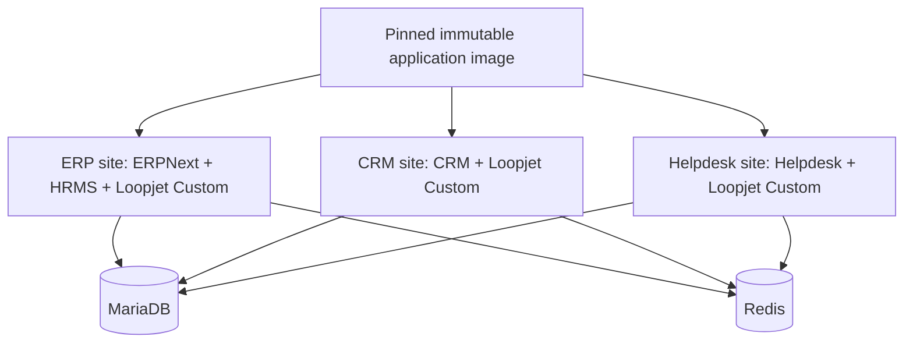

# Architecture

## Repository boundaries

The five public product repositories mirror the corresponding
Frappe upstream projects. They exist for continuity, auditability, and isolated
emergency patches. Daily workflows fast-forward their product branches, but
production does not automatically adopt those changes.

An additional `loopjet-telephony` mirror pins Helpdesk's required Telephony app.
Upstream Telephony currently has only a floating `develop` branch, so Loopjet
creates reviewed dated tags rather than allowing non-reproducible builds.

`loopjet-frappe-custom` owns Loopjet behavior. `loopjet-frappe-deployment` owns
the version lock, image build, environment composition, and operating scripts.

## Runtime

One immutable image contains Frappe Framework, ERPNext, HRMS, CRM, Helpdesk,
and Loopjet Custom. Site installation determines which apps are active:

The image uses exact official release tags and Frappe Docker's source-building `custom` Containerfile. This is
intentional: exact Frappe release tags do not always have matching prebuilt
`frappe/base` and `frappe/build` images required by the layered build.
The small reviewed build overlay caps Node's heap at 4 GB so the combined CRM
and Helpdesk frontend build remains stable on standard CI and VPS builders.

Sites have independent databases and share application code, queues, Redis,
workers, and the reverse proxy. Integrations between sites must use authenticated
APIs rather than direct database access.

## Customization policy

1. Prefer configuration supported by Frappe.
2. Export deployable configuration as narrowly filtered fixtures.
3. Use hooks and documented extension points for code behavior.
4. Use idempotent patches for data migration.
5. Modify upstream core only when no extension point exists.
6. Track any core patch on a `loopjet/*` branch with an upstream issue or PR.
